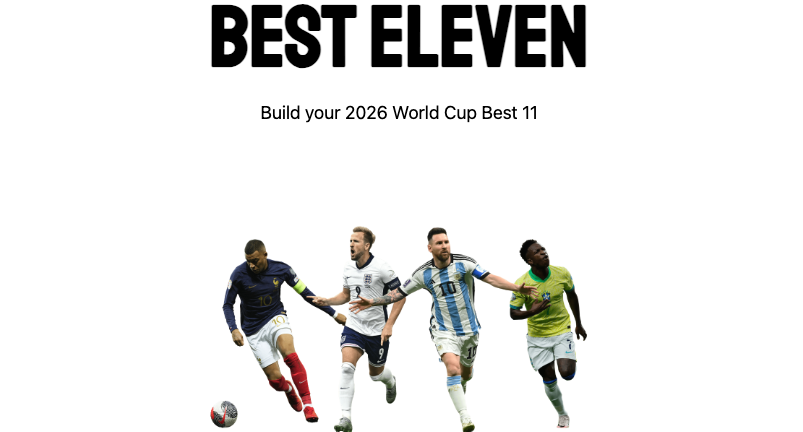

# Best Eleven

## Description

Best Eleven is a dashboard where you can select your favorite players playing in the 2026 World Cup and save them as a custom team. 

I've been really enjoying the World Cup, so I thought this was a cool way to celebrate the tournament and practice using apis. 

## Getting Started

deployed site:
https://best-eleven-cbca1258fa17.herokuapp.com/

trello:
https://trello.com/b/3Yr6KByQ/world-cup-pick-your-team

## Attributions

- [FootyRenders](https://www.footyrenders.com/) — player images
- [API-Football](https://dashboard.api-football.com/) — World Cup player data and stats

## Technologies Used

- Python
- Django
- PostgreSQL
- Heroku

## Next Steps

- Ways to compete with friends, for eaxample take turns drafting players, randomization, etc.
- Add match simulations
